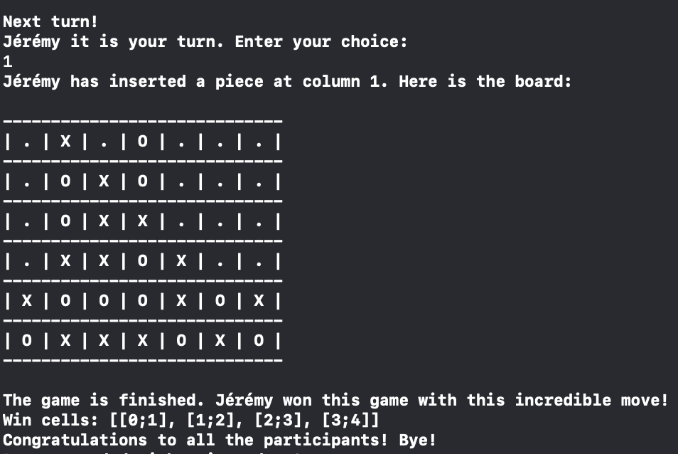

<h1 align="center">🔵 Swiftssance 4 🔴</h1>

    

The goal of Swiftssance 4 is to propose a Connect 4 game entierely made in Swift, in a Console Application.

## ✔️ Features

- [x] Play against an artificial intelligence or against another player.
- [x] See a representation of the board, the variations in the game between the moves of each player and the conclusion of the game.
- [x] Play with the classic Connect 4 rules or create your own ones!
- [x] A board compatible with multiples sizes! Makes your games shorter or longer in function of your needs!
- [x] An application conceptualize with a good Separation of concerns for more flexibility in the future!
- [x] A program tested, functionally and unitary!

## 📱 Application

Here you can see the visual of the final application in a console app: 

    

    <i>
        A game won by the player with a very smart move!
    </i>

## 🖥️ Langages and technologies used

- Swift ([API reference](https://developer.apple.com/documentation/swift))

## 🧵 Prerequisities

- [XCode](https://developer.apple.com/xcode/)

## ⚙️ How to run the app ?

1. Start the project in XCode. To do that, go in the Sources folder and open the `Swiftssance4.xcworkspace` with XCode.
2. You can select the starting project as `ConsoleApp`.
3. Run the project and enjoy!

## 📌 Documentation

Some documentation can be found in the [Wiki]("https://codefirst.iut.uca.fr/git/jeremy.tremblay/swiftssance4/wiki") of this application.

Also, look at the `Documentation` folder at the root of this repository!

## 👤 Author

**TREMBLAY Jérémy**

* Github: [@JeremyTremblay2](https://github.com/JeremyTremblay2)
* LinkedIn: [@Jérémy Tremlay](https://fr.linkedin.com/in/j%C3%A9r%C3%A9my-tremblay2)

## 📝 License

I want to leave the possibility to other people to work on this project, to improve it and to make it grow, that's why we decided to place it under MIT license.

> Read more about the [MIT licence](https://opensource.org/licenses/MIT).